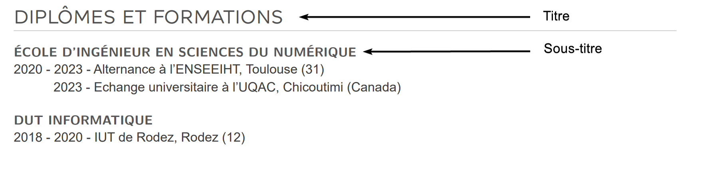
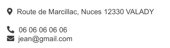
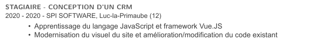

= Ecrire son CV en LaTeX
Adrien CAUBEL
22/08/2022

== Prérequis

* Posséder une distribution LaTeX (e.g :
https://www.tug.org/texlive/[texlive], https://miktex.org/[miktex])
* Connaitre les bases de LaTeX

== Définir les marges

Les marges par défaut sont trop étroites pour un CV. Le package
`+geometry+` permet de définir de nouvelles valeurs.

[source,latex]
----
\usepackage{geometry}
\geometry{
    a4paper,
    total={170mm,257mm},
    left=20mm,
    right=10mm,
    top=10mm,
    bottom=0.5mm
}
----

== Définir des styles

Votre CV est amené à évoluer textuellement et graphiquement. Concernant
l’évolution graphique afin qu’elle soit plus simple je vous recommande
de définir des styles pour chaque élement. Par exemple, pour les titres
de partie nous allons redéfinir la commande `+\section+` et pour les
"`sous-titre`" redéfinir la commande `+\subsection+`.

.titre

=== Un style pour les titres

Afin de définir nos couleurs nous avons besoin du package `+xcolor+`
(`+\usepackage{xcolor}+`)

[source,latex]
----
\definecolor{titlecolor}{HTML}{515151}
\definecolor{textcolor}{HTML}{3d3d3d}

\titleformat % design des titres des sections
{\section}
[block]
{\headingfont\Large\bfseries\color{titlecolor}}
{\thesection~)}
{\baselineskip}
{\MakeUppercase}
[\color{linecolore}\hrule\vspace{0\baselineskip}]
----

=== Un style pour les sous-titres

[source,latex]
----
\definecolor{subsectioncolor}{HTML}{565656}

\titleformat % design des titres des sections
{\subsection}
[block]
{\normalfont\sffamily\small\bfseries\color{subsectioncolor}}
{\thesection~)}
{\baselineskip}
{\MakeUppercase}
[\vspace{-0.6\baselineskip}]
----

=== Utiliser nos styles

Une fois les styles définis il nous reste plus qu’à les utiliser

[source,latex]
----
\section*{Diplômes et Formations}
\subsection*{École d'ingénieur en Sciences du Numérique}
   {\small2020 - 2023 - Alternance à l'ENSEEIHT, Toulouse (31) \\
      \hspace*{2.8em} 2023 - Echange universitaire à l'UQAC, Chicoutimi (Canada)} \\

\subsection*{DUT Informatique}
   {\small 2018 - 2020 - IUT de Rodez, Rodez (12) \\}
----

== Ajouter des ic^ones

Au lieu d’écrire _adresse_, _téléphone_ ou _email_ vous pouvez utiliser
des ic^ones représentant ces différentes notions.

=== Font Awesome

* Le package LaTeX `+fontawesome5+` fournit l’ensemble des ic^ones
disponibles par cette librairie.
* Nous vous recommandons de chercher le type d’ic^one que vous voulez
sur le site de https://fontawesome.com/v5/search[fontawesome]. Puis une
fois que vous avez le nom de l’ic^one vous référer à la documention
http://mirrors.ibiblio.org/CTAN/fonts/fontawesome5/doc/fontawesome5.pdf[documentation
du package] pour pouvoir l’ajouter dans votre document.

=== Ajouter les ic^ones au texte

Très simple, devant votre texte rajouter le nom de l’ic^one trouvé sur
la
http://mirrors.ibiblio.org/CTAN/fonts/fontawesome5/doc/fontawesome5.pdf[documentation
du package].

[source,latex]
----
\faMapMarker* \hspace{0.2mm} Route de Marcillac, Nuces 12330 VALADY \\

\faPhone* \hspace{0.2mm}  06 06 06 06 06 \\
\faEnvelope \hspace{1mm} jean@gmail.com  \\
----

.icone

== Mettre en forme ses expériences professionnelles

.experiences

Les expériences personnelles sont composées :

* d’un sous-titre
* de la date, l’entreprise et le lieu
* des tâches réalisées durant le stage ou le job

[source,latex]
----
\subsection*{Stagiaire - Conception d’un CRM}
\small{2020 - 2020 - SPI SOFTWARE, Luc-la-Primaube (12)}
\normalsize
\begin{adjustwidth}{20pt}{0pt}
   \begin{itemize}
      \vspace*{0.2em}
      \setlength\itemsep{-0.2em}
      \item Apprentissage du langage JavaScript et framework Vue.JS
      \item Modernisation du visuel du site et amélioration/modification du code existant
   \end{itemize}
\end{adjustwidth}
----

`+adjustwidth+` permet d’appliquer un retrait, ici `+20pt+` à gauche.
Ainsi, notre liste des tâches est décalée par rapport au titre.

== Utiliser des templates prédéfinis

Vous n’avez rien à compris, ou vous ne voulez pas vous embeter à créer
votre propre design. La solution est de vous rendre sur _overleaf_ dans
la section https://fr.overleaf.com/gallery/tagged/cv[cv/resume] pour
trouver le template qui vous correspond puis le modifier.
