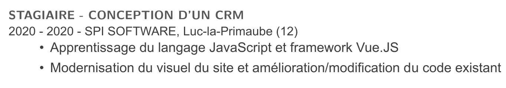

# Nombre d'arguments fixe
Lorsque vous souhaitez définir une commande ayant un nombre d'arguments fixe vous spécifier celui-ci dans la définition de votre commande, ci-dessous `6`.

```latex
\newcommand{\experience}[6]{
   % Le code de ma commande
}
```

Mais comment faire lorsque vous avez un nombre variable d'arguments ?

# Nombre d'arguments variable
Nous souhaitons réaliser l'exemple suivant où chaque numéro correspond à l'argument :

1. L'intitulé du poste
2. La date de début
3. La date de fin
4. Le nom de l'entreprise
5. Le lieu
6. Le département
7. La **liste** des travaux réalisés. Et c'est ce dernier point qui nous int\'eresse le plus.



Notre commande doit pouvoir être appelée comme suit. Où les arguments 7 et 8 sont considérés comme appartenant à une liste.

```latex
\experience
   {Stagiaire - Conception d’un CRM}
   {2020}{2020}
   {SPI SOFTWARE}{Luc-la-Primaube}{12}
   {Apprentissage du langage JavaScript et framework Vue.JS}  % arg 7
   {Modernisation du visuel du site et amélioration/modification du code existant} % arg 8
```

## Parcourir une liste

Le parcours de la liste va se faire grâce à la commande `\@ifnextchar`. Et étant donné que la commande contient le symbole `@` nous devons encadrer tout notre par l'environnement 

```latex
\makeatletter

% Mettre tout le code ici

\makeatother
```

Le parcours de la liste va se faire lors de l'appelle de la commande `\checknextarg` :

- Si un argument est présent, on appelle `\gobblenextarg` où l'argument est passé en paramètre.  
- Si après avoir réalis\'e le traitement `\formatActivity` (qui nous permet de créer un item de la liste) il existe d'autres arguments alors on appelle de nouveau `\gobblenextarg`.
```latex
\newcommand{\checknextarg}{\@ifnextchar\bgroup{\gobblenextarg}{}}
\newcommand{\gobblenextarg}[1]{\formatActivity{#1} \@ifnextchar\bgroup{\gobblenextarg}{}}
```

## La commande `experience`
Elle est très simple. Nous appliquons notre style pour les 6 premiers arguments. Puis nous appelons la commande `checknextarg` qui va traiter les arguments suivants.

```latex
\newcommand{\experience}[6]{
   \subsection*{#1}
   {\small #2 - #3 - #4, #5 (#6)}
      \checknextarg
}
```

# Code complet

```latex
\newcommand\formatActivity[1]{%
   \begin{adjustwidth}{20pt}{15pt}
   \noindent
   \makebox[5mm][c]{\textbullet}%
   \parbox[t]{\linewidth}{\strut#1\strut}%
   \par
   \end{adjustwidth}
}

\makeatletter
\newcommand{\checknextarg}{\@ifnextchar\bgroup{\gobblenextarg}{}}
\newcommand{\gobblenextarg}[1]{\formatActivity{#1} \@ifnextchar\bgroup{\gobblenextarg}{}}

\newcommand{\experience}[6]{
   \subsection*{#1}
   {\small #2 - #3 - #4, #5 (#6)}
      \checknextarg
}
\makeatother
```


# Références

- [Explication de ifnextchar](https://tex.stackexchange.com/questions/57788/understanding-ifnextchar)
- Fortement inspiré de l'article [Writing a LaTeX macro that takes a variable number of arguments](https://davidyat.es/2016/07/27/writing-a-latex-macro-that-takes-a-variable-number-of-arguments/)