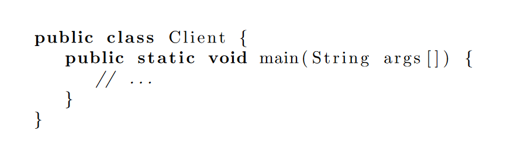
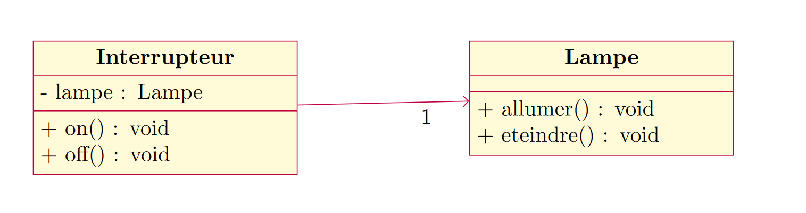
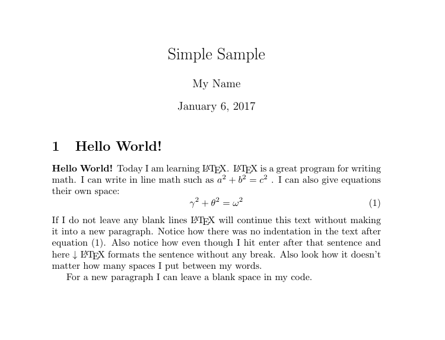

# Pourquoi ne pas utiliser LaTeX
Il y a deux principales raisons pour lesquelles LaTeX n'est peut-être pas adapté.

## Vous maitrisez Word sur le bout des doigts
Si vous maitrisez suffisamment Word pour pouvoir faire l'ensemble de votre travail, alors LaTeX vous sera inutile. Vous ne serez même pas en train de vous poser la question de changer d'éditeur de texte tellement le v\^otre vous convient.

## Vous partagez des documents
Dans le cas d'un contexte d'entreprise on est amené à partager des documents qui vont être modifiés par des tiers. La compilation d'un document LaTeX produit un PDF, le seul moyen de modifier un fichier LaTeX est de fournir les sources de votre document (fichier `.tex`). Vous êtes malheureusement obligé de vous conformer à la politique de l'entreprise, et je ne pense pas que vous arriverez à les convaincre de passer de Word à LaTeX même en leur annonçant le montant des économies réalisées via cette solution libre.

# Pourquoi je l'utilise
En tant qu'informaticien voici les deux fonctionnalités qui me manquait sous Word et qui m'ont fait pousser à utiliser LaTeX.

## Inclure du code qui rend bien
Il existe des solutions sous Word, mais quelque soit celle envisagée elle sera toujours plus compliquée que :

* Inclure le package
* Ouvrir un environnement `lstlisting`
* Coller votre code 

Vous n'avez besoin de rien de plus. Si vous voulez modifier votre code, car vous avez une erreur, alors juste à modifier le texte. 

```latex
\usepackage{listings}

\begin{lstlisting}[language=java]
public class Client {
   public static void main(String args[]) {
      // ...
   }
}
\end{lstlisting}
```

Produira l'affichage suivant dans le document, en mettant les mots-clés en gras. Vous pouvez bien\ sûr customiser le style et ajouter des couleurs comme dans ces [exemples](https://texblog.org/2011/06/11/latex-syntax-highlighting-examples/).



## Inclure des diagrammes (sans image)
La solution classique est de créer son diagramme sur [draw.io](draw.io) puis de l'exporter sous forme d'image (png ou jpeg).

Mais il y a souvent des erreurs mineures qui vous obligent à redéployer votre image :

* oubli d'un caractère
* oublie de l'accessibilité d'un attribut ou d'une méthode (signe `-` pour `private`)
* etc ...

Des développeurs ont créé un package permettant d'écrire directement (en toutes lettres) des diagrammes. Mon préféré est `pgf-umlcd` qui permet de créer des diagrammes de classes. Je vous l'avoue c'est un peu plus dur que le code, mais ça en vaut la peine. Ainsi, si vous souhaitez renommer votre classe, vous n'aurez qu'à modifier directement dans l'éditeur TeX.

```Latex
\usepackage[simplified]{pgf-umlcd}

\begin{tikzpicture}
    \begin{class}[text  width=4cm]{Interrupteur}{-7,0}
        \attribute {- lampe : Lampe }
        \operation {+  on() : void }
        \operation {+  off() : void}
    \end{class} 
    
    \begin{class}[text  width=4cm]{Lampe}{0,0}
        \attribute {}
        \operation {+  allumer() : void }
        \operation {+  eteindre() : void}
    \end{class} 

    \unidirectionalAssociation{Interrupteur}{}{1}{Lampe}
\end{tikzpicture}
```

Produira l'affichage suivant dans le document. Vous trouverez d'autres exemples surs la[documentation officielle du package](https://ctan.org/pkg/pgf-umlcd)




# Pourquoi utiliser LaTeX
La section précédente se concentrait sur mes motivations d'informaticiens, mais voici d'autres arguments plus généraux.

## Se concentrer sur l'essentiel
De nombreux articles reviennent sur ce point et à raison. LaTeX permet à l'utilisateur de **se concentrer sur le contenu** du document sans se soucier de la mise en forme qui sera effectuée automatiquement.  
Vous pouvez modifier le thème, la police, la taille, la couleur, mais ceci est subjectif. L'utilisateur LaTeX met en avant le fond, il traitera la forme avant la publication (s'il a le temps).

## Ecrire plus vite
Plus besoin d'utiliser la souris, tout ce fait en écrivant une sorte de code.

* Pour ajouter un titre `\section{Mon titre}`
* Pour ajouter un sous-titre `\subsection{Mon sous-titre}`
* Pour ajouter une table des matières `\tableofcontents`
* Pour mettre en gras `\textbf{texte en gras}`
* Pour écrire une formule mathématique `$a^2 + b^2 = c^2$`
* Et plein d'autres fonctionnalités rapides à écrire

## C'est beau et professionnel
C'est un point subjectif, mais je trouve les document LaTeX (`.pdf`) très agréables à lire par leur police, le positionnement des éléments. Pour moi, ils traduisent un certain professionnalisme se rapprochant, de documents scientifiques.



## Open Source
Vous n'avez pas besoin de payer pour utiliser LaTeX ni pour l'utilisation des éditeurs de texte.

# Je veux utiliser LaTeX
* Vous n'avez aucune contrindication à l'utilisation de LaTeX
* Vous souhaitez\ vous concentrer sur le fond
* D'autres arguments vous ont convaincu.

Alors, oui apprenez LaTeX, regardez sur le Net ce qu'il est possible de faire avec puis lancez-vous. A titre personnel, j'ai regardé quelques vidéos YouTube en français puis au bout d'une heure j'ai rédigé mon premier document (très simple). Au fur et à mesure de vos besoins, vous trouverez les packages et l'aide n\'ecessaire sur internet.

## Exemple complet
* [Code Source](exemple_simple.txt)
* [Rendu PDF](exemple_simple.pdf)

## Liens utiles
* [Overleaf](www.overleaf.com) pour commencer à écrire sans se préoccuper de l'installation du compilateur sur votre ordinateur.
* [MikTex + Tekmaker](https://www.univ-montp3.fr/miap/ens/info/Expert/ExpertDoc/TD1/exo8.html) tutoriel pour installer un compilateur et un éditeur Latex.
* [Videos](https://www.youtube.com/watch?v=tcP9wpy33fw&list=PLF5D1F10DAA072E4E) Une playlist en français pour apprendre Latex.