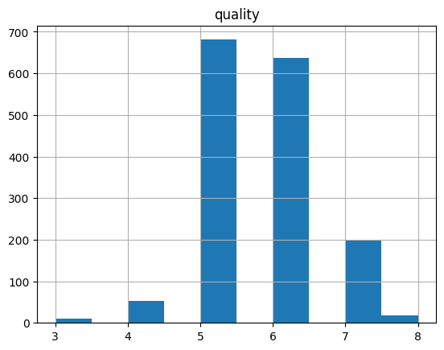

Dans cet article nous allons prédire la qualité d'un vin via la régression (mais cela nous réserve une petite surprise). Pour ce faire, nous allons utilisé le [wine dataset](https://archive.ics.uci.edu/ml/datasets/wine).

À noter, que cet article est une simplification d'un travail pratique disponible [ici](tp_regression.pdf)


# Préparation des données
## Présentation des données

```python
import pandas as pd
import numpy as np

df = pd.read_csv('winequality-red.csv', sep=';')
df.head()
```

| ID   |   fixed acidity |   volatile acidity |   citric acid |   residual sugar |   chlorides |   free sulfur dioxide |   total sulfur dioxide |   density |   pH |   sulphates |   alcohol |   quality |
|---:|----------------:|-------------------:|--------------:|-----------------:|------------:|----------------------:|-----------------------:|----------:|-----:|------------:|----------:|----------:|
|  0 |             7.4 |               0.7  |          0    |              1.9 |       0.076 |                    11 |                     34 |    0.9978 | 3.51 |        0.56 |       9.4 |         5 |
|  1 |             7.8 |               0.88 |          0    |              2.6 |       0.098 |                    25 |                     67 |    0.9968 | 3.2  |        0.68 |       9.8 |         5 |
|  2 |             7.8 |               0.76 |          0.04 |              2.3 |       0.092 |                    15 |                     54 |    0.997  | 3.26 |        0.65 |       9.8 |         5 |
|  3 |            11.2 |               0.28 |          0.56 |              1.9 |       0.075 |                    17 |                     60 |    0.998  | 3.16 |        0.58 |       9.8 |         6 |
|  4 |             7.4 |               0.7  |          0    |              1.9 |       0.076 |                    11 |                     34 |    0.9978 | 3.51 |        0.56 |       9.4 |         5 |


## Séparation des données en training et testset

```python
from sklearn.model_selection import train_test_split

X = df.iloc[:,:-1]
y = df.iloc[:,-1] # colonne quality isolée

X_train,X_test,y_train,y_test = train_test_split(X,y,test_size=0.2)
```

## Normalisation des données
```python
from sklearn.preprocessing import MinMaxScaler
mmscaler=MinMaxScaler(feature_range=(0,1))
X_train=mmscaler.fit_transform(X_train)
X_test=mmscaler.fit_transform(X_test)
X_train=pd.DataFrame(X_train)
X_test=pd.DataFrame(X_test)  
```

# Régression Linéaire
Les données traitées, nous pouvons maintenant appliquer notre algorithme de régression puis vérifier si les valeurs prédites sont correctes.

## Modèle de régression
```python
from sklearn import linear_model

regr = linear_model.LinearRegression()
regr.fit(X_train, y_train)
```

## Justesse des valeurs prédites (RMSE)
On récupère en premier les qualités prédites pour notre testset
```python
predictedQuality = regr.predict(X_test)
```

Puis on compare le résultat avec les valeurs effectives du testset : `y_test`

```python
from sklearn.metrics import mean_squared_error
import math
MSE = mean_squared_error(y_test, predictedQuality)

RMSE = math.sqrt(MSE)
```

Le résultat du RMSE avoisine les 0.59. Par conséquent, un vin noté 5 sera évalué en moyenne dans l’intervalle [4.4, 5.6]. Cette valeur est assez importante pour un intervalle allant de [0, 10].  

# Comprendre le RMSE élevé
Il faut donc comprendre pourquoi nous avions un RMSE élevé. Ainsi, nous avons regardé la répartition de la qualité de vin. On remarque que la majorité des vins ont une note de 5 ou 6. Ainsi, notre RMSE est fortement impacté par les vins notés 5, 6 ou 7.



## Évaluation de trois sous-ensembles avec RMSE
Au vu de l’histogramme, nous avons donc décidé de découper notre dataset en 3 sous-ensembles en fonction des notes :

* Dataset avec une basse qualité : notes de [0, 4]
* Dataset avec une qualité moyenne : notes de [5, 6]
* Dataset avec une haute qualité : notes de [7, 10]


Nous avons réalisé une régression linéaire multiple sur ces trois dataset puis calculé leur RSME respectif :

* Qualité basse RMSE = 0.372
* Qualité moyenne RMSE = 0.446
* Qualité haute RMSE = 0.250

## Conclusion
Les RMSE sur les trois sous-modèles sont plus petits que le RMSE sur le modèle global. Par conséquent il
serait intéressant de noter un vin en deux étapes :

1. Classifier le vin : le vin dont on souhaite prédire la qualité va être classé dans une des catégories
suivantes, mauvais, bon, excellent. En utilisant un algorithme de classification.
2. Noter le vin : une fois la classe déterminée, nous passons le vin au sous-modèle correspondant (mauvais, bon, excellent) qui étant plus précis nous permettra d’obtenir une note plus précise.