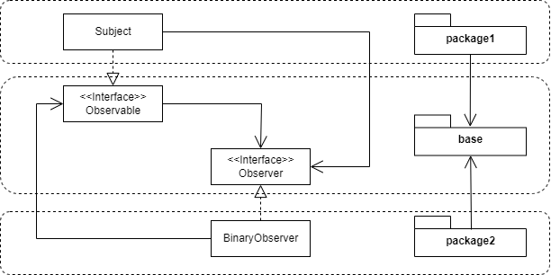

= Does the Observer design pattern have cyclic relationships ?
Adrien CAUBEL
11/01/2022
:keywords: Observer, Design Pattenrs, Cyclic relationship

In this article we are going to answer _Does the Observer design pattern
have cyclic relationships ?_ +
Indeed, in the following UML diagram `+Subject+` depends on `+Observer+`
interface and `+BinaryObserver+` depends on `+Subject+`.

image:images/observer.png[images/observer]

== Why it’s an acyclic relationship ?

=== Break cycle at the class level

According to the book
https://www.oreilly.com/library/view/java-application-architecture/9780132874779/[Java
Application Architecture by Kirk Knoernschild] it’s not a cyclic problem
because the `+ObservaterImpl+` is a concrete class. Look it !

image:images/observer.png[images/observer]

=== Break cycle at the module level

Furthermore if we put : - `+Subject+` and `+Observer+` in the same
module - `+BinaryObserver+` in another module, we have an acyclic
relationship at the module level

image:images/module.png[images/module]

Take note if we put the interface `+Observer+` with this implementation
`+ObserverImplementation+` in the same module and `+Subject+` class in
an independent module, so we would have a cyclic relationship.

=== Conclusion

* Observer design pattern has acyclic dependencies between classes
* Obersver design pattern has acyclic dependencies between modules

== But this isn’t the perfect solution !

=== Test and deploy package2

The lack of cycle is due to the
https://en.wikipedia.org/wiki/Dependency_inversion_principle[Dependency
inversion] applied without having paid attention.

____
Inverting the relationships allows us to deploy `+package2+` module
independent of the `+package1+` module.
____

=== Test and deploy package1

But I’d like to explore another option, the ability to *test* and
*deploy* the `+package1+` module independently. It’s not possible yet.

____
If I want to test and deploy both modules independently, I need to
completely eliminate the relationship altogether.
____

== Observer and Observable in Java

So, now we can add a new answer to the question _why use `+Observer+`
and the `+Observable+` (it’s class and not an interface) together ?_

Deploy `+Student+` class independently of `+MessageBoard+` class. +
_AND_ +
Deploy `+MessageBoard+` class independently of `+Student+` class.

[source,java]
----
import java.util.*;
     
public class MessageBoard extends Observable {
    private String message;
     
    public String getMessage() {
        return message;
    }
    public void changeMessage( String message ) {
        this.message = message;
        setChanged();
        notifyObservers( message );
    }
    public static void main( String [] args ) {
        MessageBoard board = new MessageBoard();
        Student bob = new Student();
        Student joe = new Student();
        board.addObserver( bob );
        board.addObserver( joe );
        board.changeMessage("More Homework!");
    }
} // end of class MessageBoard
     
class Student implements Observer {
    public void update(Observable o, Object arg) {
        System.out.println( "Message board changed: " + arg );
    }
}
----

Code issued from
https://www.oreilly.com/library/view/learning-java-4th/9781449372477/ch11s08.html[Learning
Java&#44; 4th Edition by Patrick Niemeyer&#44; Daniel Leuck] online
resources.
