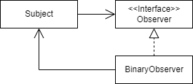

In this article we are going to answer *Does the Observer design pattern have cyclic relationships ?*  
Indeed, in the following UML diagram `Subject` depends on `Observer` interface and `BinaryObserver` depends on `Subject`.




# Why it's an acyclic relationship ?
## Break cycle at the class level
According to the book [Java Application Architecture by Kirk Knoernschild](https://www.oreilly.com/library/view/java-application-architecture/9780132874779/) it's not a cyclic problem because the `ObservaterImpl` is a concrete class. Look it !


## Break cycle at the module level
Furthermore if we put :
- `Subject` and `Observer` in the same module
- `BinaryObserver` in another module, we have an acyclic relationship at the module level


Take note if we put the interface `Observer` with this implementation `ObserverImplementation` in the same module and `Subject` class in an independent module, so we would have a cyclic relationship.

## Conclusion
- Observer design pattern has acyclic dependencies between classes
- Obersver design pattern has acyclic dependencies between modules


# But this isn't the perfect solution !
## Test and deploy package2
The lack of cycle is due to the [Dependency inversion](https://en.wikipedia.org/wiki/Dependency_inversion_principle) applied without having paid attention.

> Inverting the relationships allows us to deploy `package2` module independent of the `package1` module.

## Test and deploy package1
But I'd like to explore another option, the ability to **test** and **deploy** the `package1` module independently. It's not possible yet.

>  If I want to test and deploy both modules independently, I need to completely eliminate the relationship altogether.


# Observer and Observable in Java
So, now we can add a new answer to the question *why use `Observer` and the `Observable` (it's class and not an interface) together ?*

Deploy `Student` class independently of `MessageBoard` class.  
*AND*  
Deploy `MessageBoard` class independently of `Student` class.  


```java
import java.util.*;
     
public class MessageBoard extends Observable {
    private String message;
     
    public String getMessage() {
        return message;
    }
    public void changeMessage( String message ) {
        this.message = message;
        setChanged();
        notifyObservers( message );
    }
    public static void main( String [] args ) {
        MessageBoard board = new MessageBoard();
        Student bob = new Student();
        Student joe = new Student();
        board.addObserver( bob );
        board.addObserver( joe );
        board.changeMessage("More Homework!");
    }
} // end of class MessageBoard
     
class Student implements Observer {
    public void update(Observable o, Object arg) {
        System.out.println( "Message board changed: " + arg );
    }
}
```
Code issued from [Learning Java, 4th Edition by Patrick Niemeyer, Daniel Leuck](https://www.oreilly.com/library/view/learning-java-4th/9781449372477/ch11s08.html) online resources.